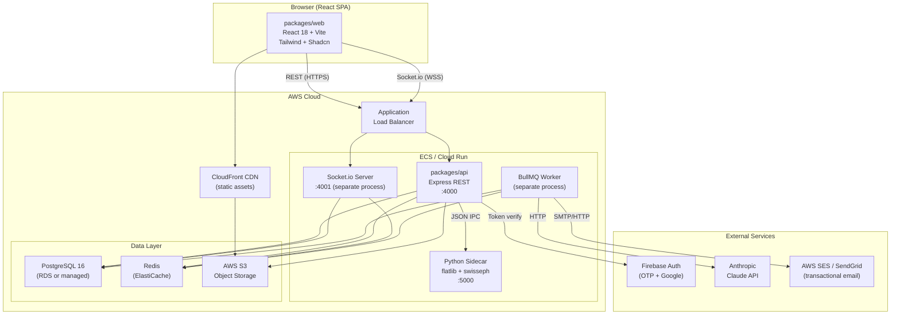
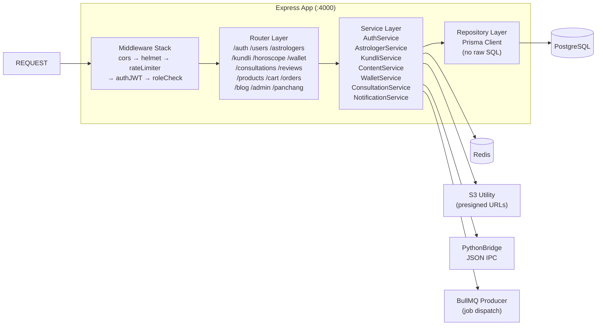
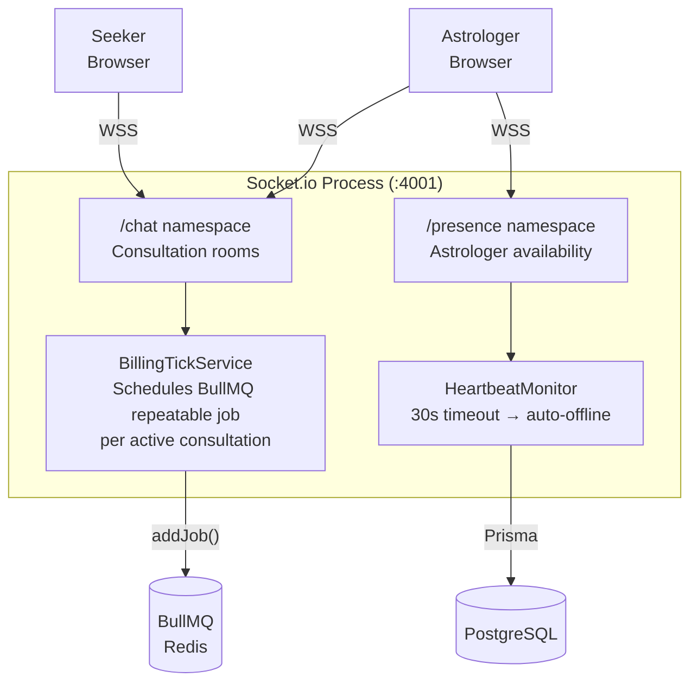
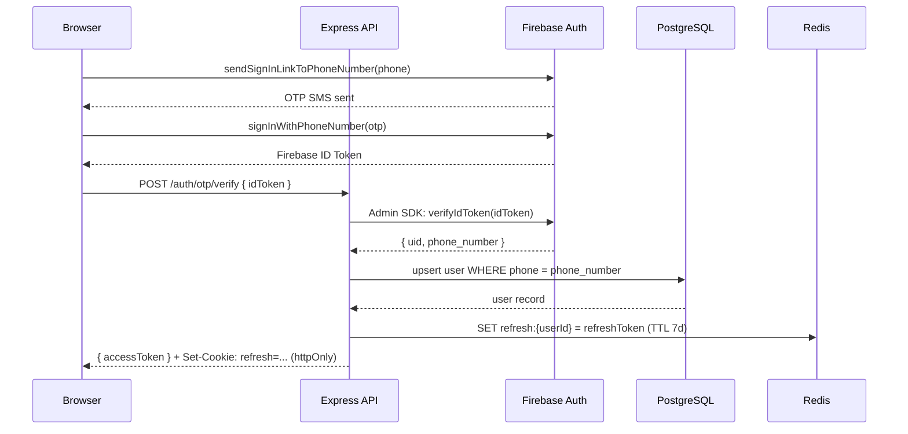
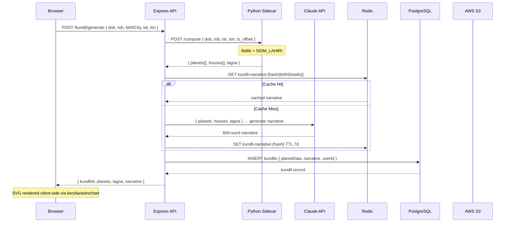
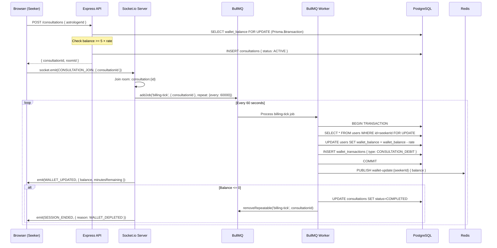
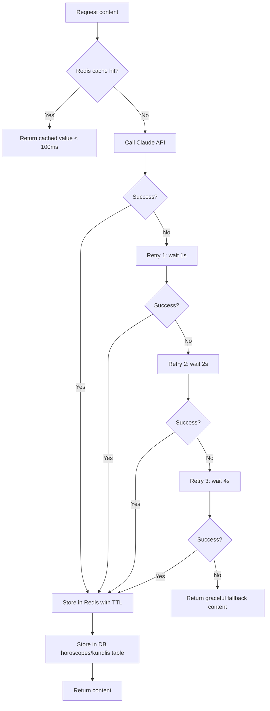

# ARCHITECTURE.md — AstroTalk Replica (Track B · BMAD Framework)

**Document Status:** v1.0 — Pending PO Review
**Produced by:** Architect Agent (BMAD Persona 2)
**Input:** PRD.md (PM Agent v1.0) + Track B Brief
**Date:** March 2026

---

## Table of Contents

1. [System Overview](#1-system-overview)
2. [Component Architecture](#2-component-architecture)
3. [Monorepo Structure](#3-monorepo-structure)
4. [Data Flow Diagrams](#4-data-flow-diagrams)
5. [Real-Time Architecture & Billing Loop](#5-real-time-architecture--billing-loop)
6. [Astrological Computation Bridge](#6-astrological-computation-bridge)
7. [AI Content Service](#7-ai-content-service)
8. [Background Job Architecture (BullMQ)](#8-background-job-architecture-bullmq)
9. [Storage Architecture (AWS S3)](#9-storage-architecture-aws-s3)
10. [Caching Strategy](#10-caching-strategy)
11. [Non-Functional Requirements](#11-non-functional-requirements)
12. [Architectural Decision Index](#12-architectural-decision-index)

---

## 1. System Overview

The AstroTalk replica is a two-sided marketplace built as a **pnpm monorepo** with three packages:

- **packages/api** — Node.js + Express + TypeScript REST API + Socket.io server
- **packages/web** — React 18 + Vite + TypeScript SPA
- **packages/shared** — Shared types, Zod schemas, Socket.io event constants, Vimshottari constants

External dependencies:
- **PostgreSQL 16** — primary data store (Prisma ORM)
- **Redis** — session store, content cache, BullMQ backing, rate limiting
- **AWS S3** — object storage (profile photos, Kundli PDFs, product images)
- **Firebase Auth** — OTP and Google OAuth identity provider
- **Anthropic Claude API** — AI-generated horoscope and Kundli narrative content
- **Python sidecar (flatlib)** — Vedic ephemeris computation; called via JSON IPC bridge

### 1.1 High-Level System Diagram



---

## 2. Component Architecture

### 2.1 API Server (packages/api)



**Layering rules:**
- Routes → Services → Repositories. No Prisma calls in route handlers.
- All request bodies and query params validated with Zod before reaching service layer.
- HTTP 400 with `{ error: string, details: ZodIssue[] }` on validation failure.

### 2.2 Socket.io Server (separate process, :4001)

Runs as a separate Node.js process to isolate billing-ticker CPU from REST request handling. See ADR-002.



### 2.3 BullMQ Worker Process (separate process)

```
Queues:
  horoscope-generation    → nightly job, all 12 signs × 3 periods
  kundli-pdf              → per-request job, Puppeteer
  email-dispatch          → transactional emails
  billing-tick            → repeatable per consultation_id (every 60s)
  wallet-purge            → nightly soft-delete cleanup (30d old)
  panchang-precompute     → nightly computation for next 7 days
```

### 2.4 Python Sidecar (flatlib + node-swisseph, :5000)

REST/JSON HTTP server. Called by KundliService via HTTP IPC on localhost.
See ADR-003 for the decision rationale.

```
POST /compute
Input:  { dob: "YYYY-MM-DD", tob: "HH:MM", lat: float, lon: float, tz_offset: float }
Output: { planets: Planet[], houses: House[], lagna: Sign|null, ayanamsa: "SIDM_LAHIRI" }
```

---

## 3. Monorepo Structure

```
astrotalk-replica/
├── packages/
│   ├── shared/
│   │   ├── src/
│   │   │   ├── events.ts          # ALL Socket.io event name constants
│   │   │   ├── constants.ts       # Vimshottari sequence, Ashta Koot config
│   │   │   ├── types/             # Shared TypeScript interfaces
│   │   │   └── schemas/           # Shared Zod schemas (reused by api + web)
│   │   ├── package.json
│   │   └── tsconfig.json
│   │
│   ├── api/
│   │   ├── src/
│   │   │   ├── app.ts             # Express app setup (no listen)
│   │   │   ├── server.ts          # HTTP server entry point
│   │   │   ├── socket-server.ts   # Socket.io process entry point
│   │   │   ├── worker.ts          # BullMQ worker entry point
│   │   │   ├── routes/            # One file per resource group
│   │   │   ├── services/          # Business logic (no Prisma direct)
│   │   │   ├── repositories/      # Prisma wrappers
│   │   │   ├── middleware/        # auth, rateLimiter, roleCheck, errorHandler
│   │   │   ├── jobs/              # BullMQ job processors
│   │   │   ├── lib/
│   │   │   │   ├── prisma.ts      # Prisma client singleton
│   │   │   │   ├── redis.ts       # ioredis client singleton
│   │   │   │   ├── s3.ts          # AWS S3 utility (presigned URLs)
│   │   │   │   ├── firebase.ts    # Firebase Admin SDK
│   │   │   │   └── python-bridge.ts # HTTP IPC client for Python sidecar
│   │   │   └── config/
│   │   │       └── index.ts       # env var validation via Zod
│   │   ├── prisma/
│   │   │   ├── schema.prisma
│   │   │   ├── migrations/
│   │   │   └── seed.ts
│   │   ├── package.json
│   │   └── tsconfig.json
│   │
│   └── web/
│       ├── src/
│       │   ├── main.tsx
│       │   ├── App.tsx
│       │   ├── pages/             # Route-level components
│       │   ├── components/        # Reusable UI components
│       │   ├── features/          # Feature-scoped components + hooks
│       │   ├── stores/            # Zustand stores (UI state only)
│       │   ├── hooks/             # TanStack Query hooks (server state)
│       │   ├── lib/
│       │   │   ├── api.ts         # Axios instance + interceptors
│       │   │   └── socket.ts      # Socket.io client singleton
│       │   └── admin/             # Lazy-loaded admin routes (ADR-008)
│       ├── index.html
│       ├── vite.config.ts
│       ├── package.json
│       └── tsconfig.json
│
├── packages/python-sidecar/
│   ├── app.py                     # FastAPI/Flask HTTP server
│   ├── compute.py                 # flatlib + swisseph computation
│   ├── requirements.txt
│   └── Dockerfile
│
├── docker-compose.yml             # Local dev (all services)
├── docker-compose.prod.yml        # Production topology reference
├── .github/
│   └── workflows/
│       └── ci.yml                 # GitHub Actions CI pipeline
├── pnpm-workspace.yaml
├── package.json                   # Root: scripts, lint, typecheck
├── DECISIONS.md
└── README.md
```

---

## 4. Data Flow Diagrams

### 4.1 User Login (OTP Flow)



### 4.2 Kundli Generation Flow



### 4.3 Consultation Start and Billing Loop



---

## 5. Real-Time Architecture & Billing Loop

### 5.1 Socket.io Namespace and Room Design

| Namespace | Purpose | Room Pattern | Auth |
|-----------|---------|-------------|------|
| `/chat` | Consultation messaging | `consultation:{id}` | JWT required |
| `/presence` | Astrologer availability | `global-presence` | Astrologer JWT |
| `/notifications` | In-app bell updates | `user:{userId}` | JWT required |

### 5.2 Billing Loop Specification (Critical)

**Job key:** `billing-tick:{consultationId}`
**Repeat interval:** 60,000ms (1 minute)
**BullMQ job options:**

```typescript
{
  jobId: `billing-tick:${consultationId}`,   // idempotent key
  repeat: { every: 60_000 },
  removeOnComplete: 10,
  removeOnFail: 50,
  attempts: 3,
  backoff: { type: 'exponential', delay: 1000 }
}
```

**Deduction transaction (SELECT FOR UPDATE):**

```sql
BEGIN;
SELECT id, wallet_balance, role
  FROM users
 WHERE id = $seekerId
   FOR UPDATE;                        -- row-level lock; concurrent ticks queue

-- Guard: balance check inside transaction
-- If balance < rate: set consultation COMPLETED, do not deduct
UPDATE users
   SET wallet_balance = wallet_balance - $rate
 WHERE id = $seekerId;

INSERT INTO wallet_transactions (user_id, type, amount, reference_id)
VALUES ($seekerId, 'CONSULTATION_DEBIT', $rate, $consultationId);

COMMIT;
```

**Race condition prevention:**
- The `FOR UPDATE` lock ensures two concurrent billing ticks on the same consultation (e.g., Redis retry) cannot double-deduct.
- `jobId` idempotency prevents duplicate repeatable jobs for the same consultation.
- Balance is checked **inside** the transaction; the session is ended if balance < rate **before** any deduction.

**Auto-disconnect sequence:**

```
1. Worker: balance < rate → UPDATE consultations SET status = COMPLETED, end_reason = WALLET_DEPLETED
2. Worker: remove BullMQ repeatable job (removeRepeatable by jobId)
3. Worker: PUBLISH Redis channel "session-ended:{consultationId}"
4. Socket.io Server: subscribed to Redis channel → emit SESSION_ENDED to room
5. Browser (Seeker): receives SESSION_ENDED → redirect to /consultations/:id/review
6. Browser (Astrologer): receives SESSION_ENDED → chat disabled, "Session ended" banner shown
```

**30-second grace period (astrologer disconnect):**

```
1. Socket.io: astrologer socket disconnects from /chat namespace
2. HeartbeatMonitor: starts 30s countdown for that socket
3. If reconnect within 30s: cancel countdown, no action
4. If no reconnect after 30s:
   a. UPDATE astrologers SET is_online = false
   b. Compute refund = rate (1 partial minute)
   c. UPDATE consultations SET status = COMPLETED, end_reason = ASTROLOGER_DISCONNECTED
   d. credit refund to seeker wallet (Prisma.$transaction + FOR UPDATE)
   e. emit SESSION_ENDED { reason: ASTROLOGER_DISCONNECTED, refundAmount } to room
   f. remove billing-tick repeatable job
```

### 5.3 Socket.io Event Contract

All event names are imported from `packages/shared/src/events.ts`. **Never string literals in application code.**

```typescript
// packages/shared/src/events.ts

export const ChatEvents = {
  JOIN:           'CONSULTATION_JOIN',
  LEAVE:          'CONSULTATION_LEAVE',
  MESSAGE_SEND:   'MESSAGE_SEND',
  MESSAGE_RECV:   'MESSAGE_RECV',
  SESSION_ENDED:  'SESSION_ENDED',
  CLOSED:         'CONSULTATION_CLOSED',
} as const;

export const WalletEvents = {
  UPDATED:        'WALLET_UPDATED',
  LOW_WARNING:    'LOW_WALLET_WARNING',
} as const;

export const PresenceEvents = {
  ASTROLOGER_ONLINE:  'ASTROLOGER_ONLINE',
  ASTROLOGER_OFFLINE: 'ASTROLOGER_OFFLINE',
} as const;

export const NotifEvents = {
  NEW_NOTIFICATION: 'NEW_NOTIFICATION',
} as const;
```

---

## 6. Astrological Computation Bridge

**Decision:** Python sidecar via JSON HTTP. See ADR-003.

### 6.1 Python Sidecar Interface

The sidecar runs as a FastAPI server on `localhost:5000` (co-located in the same ECS task or pod).

**Request:**
```json
{
  "dob": "1990-03-15",
  "tob": "14:30",
  "lat": 28.6139,
  "lon": 77.2090,
  "tz_offset": 5.5,
  "ayanamsa": "SIDM_LAHIRI"
}
```

**Response:**
```json
{
  "ayanamsa": "SIDM_LAHIRI",
  "lagna": { "sign": "Leo", "degree": 23.45 },
  "planets": [
    { "name": "Sun", "sign": "Pisces", "degree": 0.73, "nakshatra": "Uttara Bhadrapada", "house": 8, "dignity": "Neutral", "retrograde": false },
    { "name": "Moon", "sign": "Gemini", "degree": 15.22, "nakshatra": "Ardra", "house": 11, "dignity": "Neutral", "retrograde": false },
    ...
  ],
  "houses": [
    { "number": 1, "sign": "Leo", "degree": 23.45 },
    ...
  ],
  "dasha_start_planet": "Jupiter",
  "dasha_balance_years": 12.3
}
```

**Error handling:**
- HTTP 400: invalid input (future DOB, invalid TOB format)
- HTTP 422: ephemeris data unavailable for this date range
- HTTP 500: computation error (retry upstream)

**Latency expectation:** < 800ms for 95th percentile. Results are cached by KundliService in Redis keyed on SHA-256(dob+tob+lat+lon) with TTL 30 days.

### 6.2 Key Astrological Rules (Enforced by Sidecar)

1. **Ayanamsa:** SIDM_LAHIRI always. Never tropical. Never configurable.
2. **Grahas:** 9 Vedic planets only: Sun, Moon, Mars, Mercury, Jupiter, Venus, Saturn, Rahu, Ketu.
3. **Lagna:** Computed only when TOB is provided. Null otherwise — API marks `lagna: null`.
4. **Dasha start:** Vimshottari sequence starting from Moon's Nakshatra lord at DOB.
5. **Nakshatra:** Derived from Moon longitude (each = 13°20'). Pada = degree within nakshatra / 3.333.

---

## 7. AI Content Service

**Pattern:** Redis cache-first → Claude API on miss → exponential backoff → graceful fallback.

### 7.1 ContentService Flow



### 7.2 Redis TTL Strategy (see ADR-004)

| Content Type | Redis Key Pattern | TTL | Rationale |
|-------------|-------------------|-----|-----------|
| Daily horoscope | `horo:{sign}:{YYYY-MM-DD}:daily` | Until midnight UTC | Freshness: daily |
| Weekly horoscope | `horo:{sign}:{YYYY-Www}:weekly` | Until Sunday 23:59 UTC | Freshness: weekly |
| Monthly horoscope | `horo:{sign}:{YYYY-MM}:monthly` | Until month-end 23:59 UTC | Freshness: monthly |
| Love horoscope | `horo:{sign}:{YYYY-MM-DD}:love` | Until midnight UTC | Same as daily |
| Kundli narrative | `kundli-narrative:{sha256(params)}` | 7 days | Ephemeris doesn't change |
| Ephemeris computation | `ephemeris:{sha256(params)}` | 30 days | Planets don't change retroactively |
| Astrologer directory | `astrologers:directory:{page}:{filters_hash}` | 5 minutes | Frequent availability changes |
| Compatibility pair | `compat:{sign1}:{sign2}` | 30 days | Static seed data |
| Panchang | DB table `panchang_cache` | Permanent (computed once) | Deterministic astronomy |

### 7.3 Claude API Prompt Architecture

**Horoscope generation (BullMQ job, batch all 12):**
```
System: You are an expert Vedic astrologer. Generate {period} horoscopes for all 12 signs.
        Format each as JSON: { sign: string, period: string, content: string (150-200 words) }
        Be specific, practical, and positive. Avoid fatalistic predictions.
User:   Today's date: {date}. Current planetary transits: {transitData}.
        Generate daily horoscopes for all 12 zodiac signs.
```

**Kundli narrative (per-request, via ContentService):**
```
System: You are an expert Vedic astrologer. Interpret the birth chart data provided.
        Write a 600-800 word narrative covering: overall personality (Lagna + Sun), emotional nature (Moon),
        career potential, relationship patterns, current Dasha influences.
        Use plain English. Reference specific planets and houses by number.
User:   Birth chart: {planets JSON}, Lagna: {lagna}, Current Dasha: {dasha}.
```

---

## 8. Background Job Architecture (BullMQ)

### 8.1 Queue Definitions

| Queue Name | Job Types | Schedule | Concurrency | Priority |
|-----------|-----------|---------|-------------|---------|
| `horoscope-generation` | GenerateDailyHoroscope, GenerateWeekly, GenerateMonthly | Cron: 00:01 UTC daily | 1 | Low |
| `billing-tick` | BillingTick | Repeatable per consultation (60s) | 10 | Critical |
| `kundli-pdf` | GenerateKundliPDF | On-demand | 3 | High |
| `email-dispatch` | SendEmail | On-demand | 5 | Medium |
| `wallet-purge` | SoftDeletePurge | Cron: 02:00 UTC daily | 1 | Low |
| `panchang-precompute` | PrecomputePanchang | Cron: 01:00 UTC daily (next 7 days) | 1 | Low |
| `notification-dispatch` | SendInAppNotification | On-demand | 10 | High |

### 8.2 Billing Tick Job Lifecycle

```
START: POST /consultations → API creates consultation → Socket.io server adds billing-tick repeatable job
TICK:  Every 60s: Worker deducts coins, checks balance, emits WALLET_UPDATED
STOP (any of):
  - Manual end: API removes job → emits SESSION_ENDED
  - Wallet depletion: Worker removes job → emits SESSION_ENDED
  - Astrologer disconnect: Socket.io server removes job → emits SESSION_ENDED
  - Admin ban: Admin service removes job → emits SESSION_ENDED
```

---

## 9. Storage Architecture (AWS S3)

### 9.1 Bucket Structure

```
s3://astrotalk-{env}/
├── users/
│   └── {userId}/
│       └── avatar.{jpg|png}
├── astrologers/
│   └── {astrologerId}/
│       └── avatar.{jpg|png}
├── kundlis/
│   └── {kundliId}/
│       └── report.pdf
└── products/
    └── {productId}/
        ├── primary.jpg
        └── gallery/
            └── {index}.jpg
```

### 9.2 Access Pattern

- **Upload:** Client requests presigned PUT URL from API (`GET /upload-url?type=avatar`). Client uploads directly to S3. API never proxies file bytes.
- **Download:** Public read for product images and avatars (via CloudFront). Presigned GET URLs (TTL 1h) for Kundli PDFs (private).
- **Bucket policy:** Private by default. CloudFront origin access identity (OAI) for public content. Kundli PDFs: no public access.

---

## 10. Caching Strategy

### 10.1 Redis Key Namespacing

```
auth:refresh:{userId}                    → JWT refresh token (TTL 7d)
auth:ratelimit:login:{email}             → failed login attempts (TTL 15m)
auth:ratelimit:otp:{phone}               → OTP attempts (TTL 5m)
session:active:{consultationId}          → active session metadata
wallet:lowAlert:{userId}:{YYYY-MM-DD}    → low wallet email rate-limit (TTL midnight)
horo:{sign}:{date}:{period}             → horoscope content
kundli-narrative:{sha256}               → AI narrative (TTL 7d)
ephemeris:{sha256}                      → ephemeris result (TTL 30d)
astrologers:directory:{hash}            → directory page cache (TTL 5m)
panchang:{date}:{location_key}          → Panchang (TTL 24h — also in DB)
compat:{sign1}:{sign2}                  → compatibility pair (TTL 30d)
notif:unread:{userId}                   → unread count (invalidated on mark-read)
presence:{astrologerId}                 → online/offline status (TTL 90s heartbeat)
```

### 10.2 Cache Invalidation Rules

| Event | Keys to Invalidate |
|-------|-------------------|
| Admin edits horoscope | `horo:{sign}:{date}:{period}` |
| Astrologer toggles online/offline | `astrologers:directory:*` (pattern delete) |
| Astrologer profile update | `astrologers:directory:*` |
| User marks notifications read | `notif:unread:{userId}` |
| Admin changes platform settings | No Redis invalidation needed (settings read from DB) |

---

## 11. Non-Functional Requirements

| NFR | Target | Implementation |
|-----|--------|---------------|
| API response time (P50) | < 200ms | Redis cache-first; Prisma indexed queries |
| API response time (P95) | < 500ms | Connection pooling (Prisma pool max 20) |
| Horoscope page load | < 500ms | Redis cache hit; CDN for static assets |
| Kundli generation (with cache miss) | < 3s | Python sidecar < 800ms + Claude API < 2s |
| Billing accuracy | ±0 (no double-deduct, no negative balance) | SELECT FOR UPDATE; idempotent job IDs |
| Message delivery latency | < 500ms | Socket.io with Redis adapter for multi-process |
| Uptime (target) | 99.5% | ALB health checks; ECS auto-restart |
| Database connections | Max 20 concurrent | Prisma pool; PgBouncer if needed |
| Session security | JWT in memory; refresh httpOnly | Never localStorage for tokens |

### 11.1 Socket.io Redis Adapter

Because Socket.io runs as a separate process from the API, and may scale horizontally, a Redis adapter is required so events emitted from the worker process reach the correct Socket.io process.

```
API process → REDIS PUBLISH "io:emit:{room}" → Socket.io process → client socket
```

Package: `@socket.io/redis-adapter` (ioredis publisher + subscriber).

---

## 12. Architectural Decision Index

| ADR | Decision | File |
|-----|---------|------|
| ADR-001 | CSR (Vite) chosen over SSR (Next.js) | ADR-001.md |
| ADR-002 | Socket.io runs as a separate process from Express | ADR-002.md |
| ADR-003 | Python sidecar via JSON HTTP over gRPC or native node-swisseph FFI | ADR-003.md |
| ADR-004 | Redis TTL strategy for AI-generated content | ADR-004.md |
| ADR-005 | Astrologer availability via Socket.io presence room (not polling) | ADR-005.md |
| ADR-006 | Puppeteer (headless Chrome) chosen for PDF generation | ADR-006.md |
| ADR-007 | Cart stored in DB table (not Redis session) | ADR-007.md |
| ADR-008 | Admin SPA as lazy-loaded routes in the main React app | ADR-008.md |

---

*ARCHITECTURE.md — AstroTalk Replica Track B | BMAD Framework | Architect Agent v1.0*
